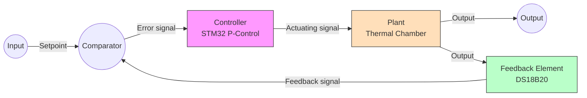
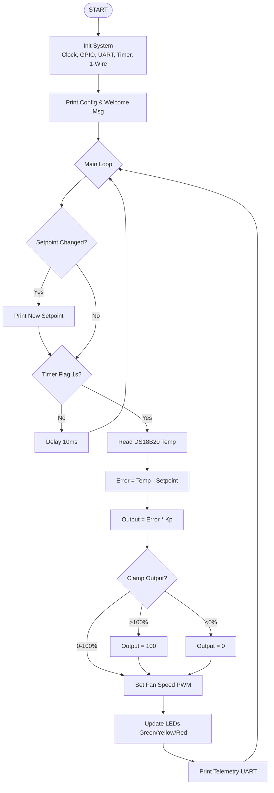
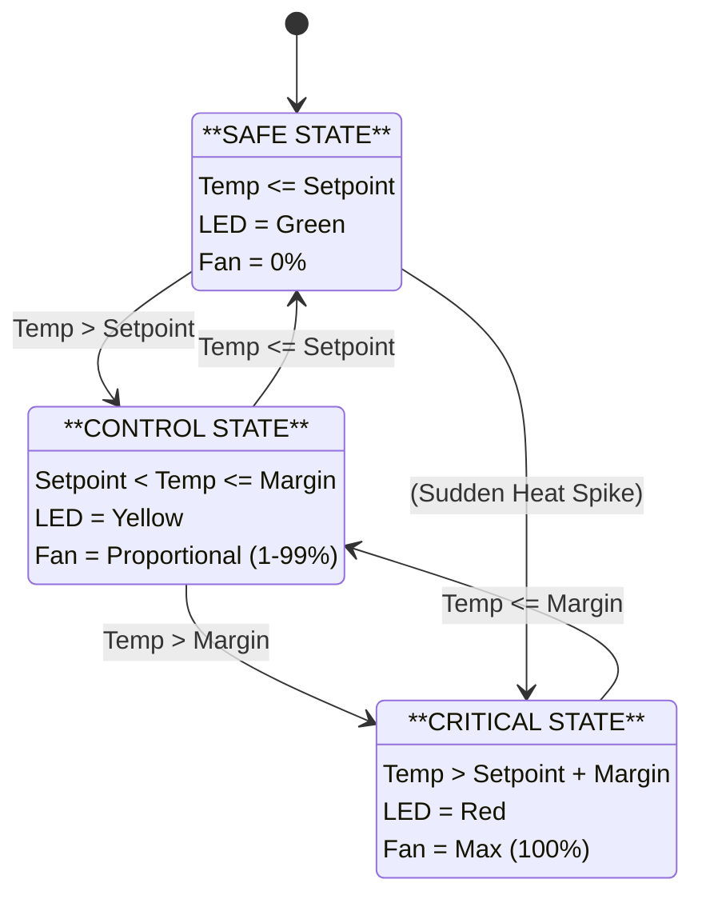
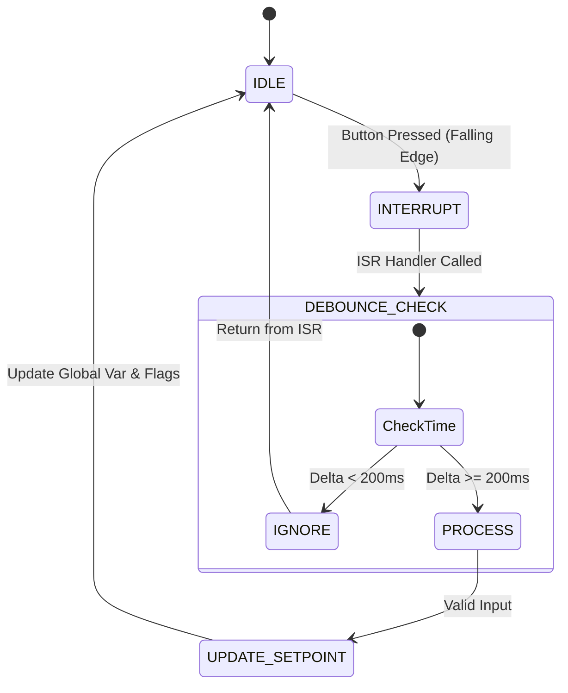

# Template Tugas Besar Mikroprosesor dan Antarmuka

# TEMPLATE PROPOSAL DAN LAPORAN AKHIR

## TUGAS BESAR MIKROPROSESOR DAN ANTARMUKA

## COVER PAGE

```markdown
UNIVERSITAS TELKOM
FAKULTAS TEKNIK ELEKTRO
PROGRAM STUDI TEKNIK KOMPUTER

LAPORAN TUGAS BESAR
MIKROPROSESOR DAN ANTARMUKA

[JUDUL PROYEK]
Contoh: REACTION TIME GAME DENGAN STM32F411
IMPLEMENTASI I2C, TIMER INTERRUPT, DAN REGISTER-BASED PROGRAMMING

Kelompok: 7

1. Firdaus Arif Ramadhani (101032300131) - [Bagian Tugas]
2. Azmi Aziz Syahputra (101032300131) - [Bagian Tugas]
3. Muhammad Haiqal (101032300125) - [Bagian Tugas]
4. Muhammad Arman Baihaqi (101032300190) - [Bagian Tugas]

Dosen: Faisal Candrasyah Hasibuan, S.T., M.T.

SEMESTER 5 - TAHUN AKADEMIK 2025/2026
```

---

## ABSTRAK

**[150-200 kata dalam Bahasa Indonesia dan Inggris]**

Template:

Laporan ini menjelaskan implementasi [nama sistem] menggunakan mikrokontroler STM32F411 untuk memenuhi CLO3. Sistem dirancang untuk [tujuan utama].

Implementasi meliputi: (1) komunikasi serial [I2C/UART/SPI] untuk [fungsi], (2) timer interrupt untuk [fungsi], (3) external interrupt untuk [fungsi].

Sistem terdiri dari [X] subsistem utama: [sebutkan singkat]. Hasil pengujian menunjukkan [hasil key findings]. Implementasi berbasis register menunjukkan pemahaman arsitektur STM32 pada level peripheral.

Kata Kunci: STM32F411, I2C/UART/SPI, Timer Interrupt, Register Programming, [keyword spesifik proyek]

---

# BAB I: PENDAHULUAN

## 1.1 Latar Belakang

**[Minimal 100 kata]**

Template paragraf:

[Kalimat pembuka tentang pentingnya mikroprocessor/mikrokontroler]

[Jelaskan pentingnya serial communication (I2C/UART/SPI) dalam konteks proyek]

[Jelaskan pentingnya timer dan interrupt dalam proyek]

[Jelaskan pentingnya register-level programming untuk pemahaman mendalam]

[Jelaskan pemilihan proyek dan relevansinya]

## 1.2 Rumusan Masalah

1. Bagaimana mengimplementasikan komunikasi serial [I2C/UART/SPI] berbasis register?
2. Bagaimana mengkonfigurasi timer untuk [fungsi spesifik]?
3. Bagaimana mengimplementasikan interrupt system dengan [requirement]?
4. Bagaimana mengintegrasikan multiple peripheral dalam sistem?

## 1.3 Tujuan

- **Umum**: [Tujuan utama proyek]
- **Khusus**:
  - Serial Communication (20%): [target spesifik]
  - Timer & Interrupt (40%): [target spesifik]
  - Register Programming (30%): [target spesifik]
  - Integration (10%): [target spesifik]

## 1.4 Batasan Masalah

- Hardware: [sebutkan]
- Software: [sebutkan]
- Lingkup: [sebutkan]

## 1.5 Manfaat

- Pembelajaran: [manfaat edukatif]
- Teknis: [manfaat skill]
- Aplikatif: [manfaat praktis]

---

# BAB II: LANDASAN TEORI

## 2.1 Mikrokontroler STM32F411

**[Jelaskan arsitektur ARM Cortex-M4 board yang digunakan]**

## 2.2 Serial Communication

### 2.2.1 Protokol UART _(jika digunakan)_

- Baud rate calculation
- Frame format
- Register: USART_CR1, USART_SR, USART_DR, USART_BRR

## 2.3 Timer dan Counter

- Timer clock
- Prescaler dan Auto-Reload Register
- Timer modes: Counter, PWM, Input Capture
- Register: TIMx_CR1, TIMx_PSC, TIMx_ARR, TIMx_CNT

## 2.4 Interrupt System

- NVIC (Nested Vectored Interrupt Controller)
- External Interrupt (EXTI)
- Interrupt priority
- Register: EXTI_IMR, EXTI_RTSR, EXTI_FTSR, NVIC_ISER

## 2.5 GPIO Configuration

- Input modes: Floating, Pull-up/down, Analog
- Output modes: Push-pull, Open-drain
- Register: GPIOx_CRL, GPIOx_CRH, GPIOx_IDR, GPIOx_ODR

## 2.6 ADC _(jika digunakan)_

- Conversion modes
- Sampling time
- Register: ADC_CR1, ADC_CR2, ADC_SQR, ADC_DR

---

# BAB III: REQUIREMENT DAN SPESIFIKASI SISTEM

## 3.1 System Requirements

Sistem **Automatic Fan Speed Control** bertujuan untuk mengatur kecepatan kipas secara otomatis berdasarkan pembacaan suhu real-time dari sensor, guna menjaga suhu operasional yang optimal pada target perangkat keras. Sistem ini dirancang menggunakan mikrokontroler STM32F411 dengan pendekatan _Register Level Programming_ (tanpa ketergantungan pada HAL library) untuk memaksimalkan efisiensi instruksi dan memberikan kontrol penuh terhadap peripheral perangkat keras. Implementasi sistem mencakup integrasi sinkron berbagai modul seperti GPIO, Timer (PWM & Interrupt Management), dan komunikasi serial.

Persyaratan operasional utama sistem mencakup:

- **Input Handling**: Sistem harus mampu mengakuisisi data suhu lingkungan dari sensor digital DS18B20 menggunakan protokol _OneWire_ bit-banging dengan resolusi 9-12 bit dan interval sampling minimum 750 ms. Selain itu, sistem menyediakan antarmuka interaktif melalui dua tombol fisik (Active Low) untuk konfigurasi _Setpoint_ suhu secara dinamis. Algoritma _software debouncing_ berbasis _system tick_ diterapkan untuk memastikan integritas sinyal input dari pengguna.
- **Output/Display**: Sistem mengimplementasikan algoritma kendali **Proportional (P-Controller)** untuk mengatur kecepatan putar kipas secara linear terhadap deviasi suhu (_error_). Output sinyal kendali berupa gelombang PWM (_Pulse Width Modulation_) yang dibangkitkan oleh Timer 1 dengan resolusi presisi. Sebagai umpan balik visual instan, sistem mengendalikan tiga indikator LED: Hijau (Aman/Target Tercapai), Kuning (Proses Pendinginan/Linear Region), dan Merah (Critical/Saturasi Maksimal).
- **Communication**: Sistem wajib menyediakan antarmuka _Telemetri_ real-time melalui protokol komunikasi asinkron UART (USART1) dengan kecepatan 115200 baud. Sistem mengirimkan buffer data terformat setiap detik yang berisi informasi vital: _timestamp_ operasi, pembacaan suhu aktual, _setpoint_ aktif, dan _duty cycle_ kipas. Data ini digunakan untuk verifikasi respon sistem dan _tuning_ parameter kendali pada sisi komputer host.

## 3.2 Functional Requirements

| ID    | Requirement                                                                                                        | Priority |
| ----- | ------------------------------------------------------------------------------------------------------------------ | -------- |
| FR-01 | Sistem harus mampu membaca data suhu dari sensor DS18B20 dengan presisi minimal 0.5°C setiap 750-1000ms.           | High     |
| FR-02 | Sistem harus mampu mengatur kecepatan kipas (PWM) secara otomatis dan linear berdasarkan selisih suhu vs setpoint. | High     |
| FR-03 | Sistem harus menyediakan antarmuka tombol untuk mengubah nilai _Setpoint_ suhu (naik/turun) secara _real-time_.    | High     |
| FR-04 | Sistem harus memberikan indikasi visual status termal (Aman/Warning/Critical) melalui 3 warna LED berbeda.         | Medium   |
| FR-05 | Sistem harus mengirimkan data telemetri (Suhu, Setpoint, Fan Speed) ke Serial Monitor via UART setiap detik.       | Medium   |

## 3.3 System Specifications

### 3.3.1 Hardware Specifications

**Komponen Utama:**

| Komponen       | Spesifikasi   | Jumlah | Fungsi           |
| -------------- | ------------- | ------ | ---------------- |
| Mikrokontroler | STM32F4xx     | 1      | Processing unit  |
| LCD            | 16x2 I2C      | 1      | Display output   |
| Button         | Push button   | 2      | User input       |
| LED            | 5mm           | 3      | Visual indicator |
| [tambahkan]    | [spesifikasi] | [qty]  | [fungsi]         |

**Pin Mapping:**

| Pin STM32 | Connect To                   | Fungsi                             | Peripheral  |
| --------- | ---------------------------- | ---------------------------------- | ----------- |
| PA0       | Sensor DS18B20               | Input Data Suhu (1-Wire)           | GPIO_OD     |
| PA8       | Driver Kipas (TIP120/MOSFET) | Output PWM Kecepatan Kipas         | TIM1_CH1    |
| PA9       | USB-TTL (RX Pin)             | UART TX (Kirim Telemetri)          | USART1_TX   |
| PA10      | USB-TTL (TX Pin)             | UART RX (Debug Input)              | USART1_RX   |
| PA13      | ST-Link V2                   | Serial Wire Debug Data (SWDIO)     | SWD         |
| PA14      | ST-Link V2                   | Serial Wire Debug Clock (SWCLK)    | SWD         |
| PB0       | LED Hijau                    | Indikator _Safe_ (<= Setpoint)     | GPIO_Output |
| PB1       | LED Kuning                   | Indikator _Proportional_ (Control) | GPIO_Output |
| PB2       | LED Merah                    | Indikator _Critical_ (Overheat)    | GPIO_Output |
| PB4       | Push Button 1                | Tombol Setpoint UP (+1°C)          | GPIO_EXTI4  |
| PB5       | Push Button 2                | Tombol Setpoint DOWN (-1°C)        | GPIO_EXTI5  |

### 3.3.2 Software Specifications

- **Development Environment**: VSCode + PlatformIO
- **Framework & Library**: STM32Cube (CMSIS Core) - _Pure Register Level Programming_ (No HAL/LL drivers used)
- **Programming Language**: C (Standards C99/C11)
- **System Clock**: 100 MHz (Source: HSI 16MHz -> PLL)
- **Data Communication**:
  - UART: 9,600 bps, 8 Data bits, No Parity, 1 Stop bit (8N1)
  - OneWire: Bit-banging protocol (custom implementation for DS18B20)
- **Timer Configuration**:
  - TIM1: PWM Generation (20 kHz)
  - TIM2: System Tick & Interrupt (1 uS Resolution)

---

# BAB IV: PERANCANGAN SISTEM

## 4.1 Arsitektur Sistem

**Block Diagram (Closed Loop System):**



Sistem ini menerapkan **Closed-Loop Control System** karena terdapat umpan balik (_feedback_) dari sensor suhu. Pembacaan suhu aktual dikembalikan ke kontroler untuk dibandingkan dengan _setpoint_ yang diinginkan, menghasilkan sinyal _error_ yang dikoreksi secara terus-menerus oleh algoritma P-Controller.

## 4.2 Desain Hardware

### 4.2.1 Schematic Diagram

[Gambar schematic diagram lengkap dengan nilai komponen]

Minimal berisi:

- STM32 pin connections
- Pull-up/down resistors
- Current limiting resistors
- Decoupling capacitors

### 4.2.2 Bill of Materials (BOM)

| No        | Komponen   | Nilai/Tipe | Qty   | Harga (Rp)  |
| --------- | ---------- | ---------- | ----- | ----------- |
| 1         | STM32F4xxx | -          | 1     | 85.000      |
| 2         | LCD I2C    | 16x2       | 1     | 15.000      |
| [dst]     | [komponen] | [nilai]    | [qty] | [harga]     |
| **TOTAL** |            |            |       | **[total]** |

## 4.3 Desain Software

### 4.3.1 Flowchart Sistem



### 4.3.2 State Machine Diagram



### 4.3.3 Timing Diagram

[Gambar timing diagram untuk I2C/UART/interrupt]

Contoh I2C Timing:

```
SCL ──┐  ┌─┐ ┌─┐ ┌─┐ ┌─┐ ┌─┐ ┌─┐ ┌─┐ ┌─┐ ┌─┐
      └──┘ └─┘ └─┘ └─┘ └─┘ └─┘ └─┘ └─┘ └─┘ └──
SDA ────┐ ┌──[A6..A0]──┬──[Data]──┬──
        └─┘           └─────────┘
    START  ADDRESS       DATA    STOP
```

## 4.4 Desain Subsistem

### 4.4.1 Subsistem Input (EXTI & GPIO)

**Design Debouncing:**

Sistem menerapkan **Software Debouncing** berbasis waktu (_Time-based_) menggunakan `SysTick` timer. Hal ini diperlukan karena tombol mekanis memiliki karakteristik _bouncing_ (sinyal tidak stabil) saat ditekan.

- **Metode**: Ignoring Interrupts inside window.
- **Threshold Waktu**: 200 ms (`DEBOUNCE_MS`).
- **Logika**: Setiap kali EXTI terjadi, sistem memeriksa selisih waktu dengan `last_button_time`. Jika `(CurrentTime - LastTime) < 200ms`, maka interrupt dianggap _noise_ (bounce) dan diabaikan.

**State Machine (Button Logic):**



Transitions:

- **Idle → Interrupt**: Sinyal fisik jatuh ke LOW (Active-Low), memicu EXTI Handler.
- **Debounce Check**: Handler membandingkan timestamp saat ini dengan timestamp terakhir.
- **Ignore**: Jika waktu terlalu singkat (<200ms), dianggap _glitch/bounce_.
- **Process**: Jika waktu cukup (>200ms), dianggap input valid dan aksi dijalankan.

### 4.4.2 Subsistem Timing (Timer Dynamics)

**Konfigurasi Timer Counter:**

- Clock source: APB1 × 1 = 16MHz
- Prescaler: PSC = 16 - 1 = 15
- f_timer = 16MHz / 16 = 1MHz
- Resolution: 1μs per count

**Auto-Reload Register (ARR):**

Untuk interrupt setiap 1ms:

ARR = (1ms × 1MHz) - 1 = 999

### 4.4.3 Subsistem Display (I2C Communication)

**I2C Clock Calculation:**

I2C Clock Calculation:

CCR = f_APB1 / (2 × f_I2C)

frekuensi i2c =

**State Machine:**

States: [Idle, Start, Address, Write_Data, Stop]

Transitions:

- Idle → Start: Ketika ada data untuk dikirim
- Start → Address: Setelah START condition
- Address → Write_Data: Jika ACK received
- Write_Data → Stop: Setelah semua data terkirim

### 4.4.4 Subsistem ADC (Optional)

**Konversi ADC:**

V_digital = (ADC_value / 4095) × V_ref

Sampling Time:

t_sample = (SMP + 12.5) / f_ADC

Dengan:

- SMP = 55.5 cycles (konfigurasi)
- f_ADC = 12MHz (maksimum)
- t_sample = 5.625μs

---

# BAB V: IMPLEMENTASI

## 5.1 Implementasi Hardware

[Foto hasil rakitan hardware dari berbagai angle]

[Foto close-up koneksi penting]

[Foto testing dengan multimeter/oscilloscope/logic analyzer] optional

## 5.2 Implementasi Software (Register-Based)

### 5.2.1 RCC Configuration

**Kode:**

```c
void RCC_init(void) {
    // [Lengkapi dengan penjelasan setiap register]
}
```

**Penjelasan Register:**

| Register | Bit   | Value    | Fungsi   |
| -------- | ----- | -------- | -------- |
| RCC->x   |       | 1        |          |
| RCC->x   |       | 1 (read) |          |
| [dst]    | [bit] | [value]  | [fungsi] |

### 5.2.2 GPIO Configuration

**Kode:**

```c
void GPIO_Config(void) {
    // [Kode konfigurasi GPIO]
}
```

**Penjelasan Register:** [Tabel penjelasan]

### 5.2.4 Timer Configuration

**Kode:**

```c
void Timer_Config(void) {
    // [Kode konfigurasi Timer]
}
```

**Penjelasan Register:** [Tabel penjelasan]

### 5.2.5 External Interrupt Configuration

**Kode:**

```c
void EXTI_Config(void) {
    // [Kode konfigurasi EXTI]
}
```

**Penjelasan Register:** [Tabel penjelasan]

### 5.2.6 Interrupt Service Routines

**Kode:**

```c
void TIM2_IRQHandler(void) {
    // [Kode ISR]
}

void EXTI0_IRQHandler(void) {
    // [Kode ISR]
}
```

**Analisis ISR:**

- Execution time: [waktu]
- Priority: [level priority]
- Critical section: [bagian critical]

## 5.3 Pembagian Tugas Kelompok

| Anggota | Tugas                              | Status |
| ------- | ---------------------------------- | ------ |
| FAR     | Hardware Design & Wiring, GPIO     | ✓      |
| AZM     | UART, Timer Counter, Documentation | ✓      |
| ARM     | Interrupt, Itegration & Testing    | ✓      |

---

# BAB VI: PENGUJIAN DAN ANALISIS

## 6.1 Metodologi Pengujian

- Unit Testing: [jelaskan]
- Integration Testing: [jelaskan]
- System Testing: [jelaskan]
- Tools: Logic analyzer, oscilloscope, multimeter

## 6.2 Pengujian Sistem Keseluruhan

**Skenario Pengujian:**

1. [Skenario 1]
2. [Skenario 2]
3. [dst]

**Hasil:** [Tabel hasil]

**Dokumentasi:**

[Foto/video demonstrasi sistem berfungsi]

## 6.6 Troubleshooting

| Problem         | Cause      | Solution   |
| --------------- | ---------- | ---------- |
| I2C not working | [penyebab] | [solusi]   |
| [problem]       | [cause]    | [solution] |

---

# BAB VII: KESIMPULAN DAN SARAN

## 7.1 Kesimpulan

1. [Kesimpulan terkait CLO3: Serial Communication]
2. [Kesimpulan terkait CLO3: Timer & Interrupt]
3. [Kesimpulan terkait register-level programming]
4. [Kesimpulan hasil pengujian]

## 7.2 Saran

1. [Saran pengembangan sistem]
2. [Saran pembelajaran]
3. [Saran penelitian lanjutan]

---

# AI Editing Statement

Saya menyatakan bahwa saya menggunakan alat kecerdasan buatan (AI) hanya untuk keperluan editing, termasuk perbaikan tata bahasa, penyusunan kalimat, konsistensi istilah, dan peningkatan keterbacaan dokumen ini.

Seluruh ide, analisis, perhitungan, desain, dan konten substantif merupakan hasil pekerjaan saya sendiri. AI tidak digunakan untuk menghasilkan konten inti, menyelesaikan tugas teknis, atau membuat analisis secara otomatis.

Sebagai bentuk transparansi, berikut adalah daftar penggunaan AI beserta nama alat AI yang digunakan:

| No. | Bagian yang Diedit      | Jenis Bantuan AI | Nama AI yang Digunakan |
| --- | ----------------------- | ---------------- | ---------------------- |
| 1   | (isi sesuai penggunaan) | (jenis bantuan)  | (nama AI)              |
| 2   | (isi sesuai penggunaan) | (jenis bantuan)  | (nama AI)              |
| 3   | (isi sesuai penggunaan) | (jenis bantuan)  | (nama AI)              |

Nama Mahasiswa: (Mahasiswa 1, 2, 3)

NIM:

Tanggal:

---

# DAFTAR PUSTAKA

[1] STMicroelectronics. (2024). STM32F411xx Reference Manual

[2] ARM. (2024). Cortex-M3 Technical Reference Manual.

[3] [Tambahkan referensi buku/paper/tutorial yang digunakan]

---

# LAMPIRAN

## LAMPIRAN A: Full Source Code

// [Lampirkan full source code dengan comments jangan screenshoot]

## LAMPIRAN B: Datasheet Excerpts

[Screenshot bagian penting dari datasheet]

## LAMPIRAN C: Testing Results

[Data lengkap hasil pengujian]

## LAMPIRAN D: Video Demonstration

Link: [URL YouTube/Drive]

QR Code: [QR code ke video]

---

## CHECKLIST KELENGKAPAN LAPORAN

**Content: 10%**

- [ ] Abstrak
- [ ] BAB I-VII lengkap
- [ ] Minimum 20 halaman (tidak termasuk lampiran)
- [ ] Semua gambar, table diberi caption dan nomor

**Technical: 40%**

- [ ] Register configuration explained dengan tabel
- [ ] Schematic diagram, jelas dan lengkap
- [ ] Flowchart dan state machine included
- [ ] Photo dokumentasi hardware
- [ ] Video demonstration

**CLO3 Requirements: 40 %**

- [ ] Penerapan Serial communication (I2C/UART/SPI)
- [ ] Penerapan Timer configuration explained
- [ ] Interrupt system explained
- [ ] Register-level code documented
- [ ] Integration testing performed

**Formatting: 10%**

- [ ] Font: Times New Roman 12pt
- [ ] Line spacing: 1.5
- [ ] Margin: 4-3-3-3 cm
- [ ] Page numbers
